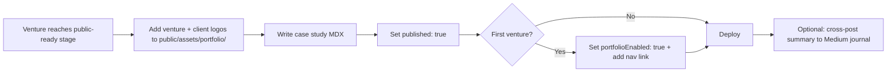

# Vuka Ventures — Implementation Plan
### Astro · Tailwind CSS · Medium + MDX · vukaventures.co
*Updated June 2026 · reflects portfolio CMS and logo asset decisions*

---

## How to use this document

This is the master build plan for the Vuka marketing site. It synthesises:

- `docs/vuka-information-architecture.md` — routes, sections, audience journeys
- `docs/vuka-website-copy-complete.md` — production copy
- `Vuka Design System/` — tokens, components, assets
- `.cursor/rules/` — Cursor agent instructions for consistent UI

Read this before starting any phase. Cross-reference the Cursor rules when implementing components.

---

## Vision

A **fully responsive, typography-led, bold and minimalist** static site:

- Warm parchment canvas, ember accents, Codec Pro throughout
- No stock photography — type, colour, and logos carry the design
- Five-lane audience funnel from homepage → audience page → pathway → work-with-us
- Fast (Astro SSG), credible (published thesis), stage-honest (portfolio hidden until ready)

---

## Tech stack

| Layer | Choice | Role |
|-------|--------|------|
| Framework | **Astro 5** | Static site generation; islands only where needed |
| Styling | **Tailwind CSS v4** | Utilities mapped to Vuka design tokens |
| Language | **TypeScript** | Frontmatter, content schemas, utilities |
| Long-form CMS | **Medium** | Our thesis + Studio journal (RSS at build time) |
| Portfolio CMS | **Astro content collections (MDX)** | Structured case studies with logo assets |
| Marketing copy | **`src/data/copy/`** | Typed objects sourced from copy doc |
| Interactivity | Astro `<script>` + minimal islands | Nav, filters, contact form |
| Hosting | Vercel / Netlify / Cloudflare Pages | Deploy on push; webhook on Medium publish |

---

## Content architecture

Three content sources — each chosen for how often it changes and how structured it is.

```mermaid
flowchart TB
    subgraph static [Static — in repo]
        COPY[src/data/copy/]
        PAGES[Marketing pages]
        COPY --> PAGES
    end

    subgraph medium [Medium — build-time fetch]
        THESIS[thesis tag]
        JOURNAL[journal tag]
        THESIS --> ROUTES1[/our-thesis/slug]
        JOURNAL --> ROUTES2[/studio-journal/slug]
    end

    subgraph portfolio [Portfolio — MDX in repo]
        MDX[src/content/portfolio/*.mdx]
        LOGOS[public/assets/portfolio/]
        MDX --> ROUTES3[/portfolio/slug]
        LOGOS --> MDX
    end

    BUILD[Astro build] --> DIST[dist/]
    PAGES --> BUILD
    ROUTES1 --> BUILD
    ROUTES2 --> BUILD
    ROUTES3 --> BUILD
```

### Content source matrix

| Content | Source | Update frequency | Why |
|---------|--------|------------------|-----|
| Homepage, pathways, audiences, work-with-us | `src/data/copy/` | Rare — copy doc is source of truth | Approved marketing copy; no CMS overhead |
| Our thesis | **Medium** (`thesis` tag) | Occasional essays | Editorial workflow; RSS-friendly |
| Studio journal | **Medium** (`journal` tag) | Build-in-public posts | Same workflow as thesis |
| Portfolio case studies | **MDX** (`src/content/portfolio/`) | Rare — per completed venture | Structured fields + logos; publish control |
| Venture & client logos | **`public/assets/portfolio/`** | Per venture | SVG assets referenced in MDX frontmatter |

### Why portfolio is not on Medium

Portfolio needs structured metadata (sector, pathway, stage, venture logo, client logos) and explicit publish gating. Medium provides title, tags, and body only — insufficient for the portfolio grid and case study template. Medium remains optional as a **distribution channel** (cross-post founder stories to journal); canonical URLs stay on vukaventures.co.

---

## Portfolio system

### Launch behaviour

- **Hidden at launch** — omit `/portfolio` from nav, sitemap, and footer
- **No placeholder page** — studio journal carries build-in-public proof until first venture is public-ready
- **Activation** — set `portfolioEnabled: true` in `src/config/site.ts` when first venture ships

### MDX schema (`src/content/config.ts`)

```typescript
const portfolio = defineCollection({
  type: 'content',
  schema: z.object({
    title: z.string(),
    slug: z.string(),
    sector: z.enum([
      'B2B Infrastructure & Fintech',
      'Applied AI',
      'Climate & Energy Access',
      'Government Digital Services',
      'Applied Technology',
    ]),
    pathway: z.enum([
      'studio-origination',
      'founder-in-residence',
      'corporate-spinout',
      'government-innovation',
    ]),
    stage: z.string(), // e.g. "Operational · Established clients"
    summary: z.string(),
    logo: z.string(),                    // venture logo path
    logoDark: z.string().optional(),     // for dark/emer sections
    clientLogos: z.array(z.object({
      name: z.string(),                  // alt text
      src: z.string(),
    })).optional(),
    featured: z.boolean().default(false),
    published: z.boolean().default(false), // false = excluded from build output
    order: z.number().default(0),
  }),
});
```

### Logo asset structure

```
public/assets/portfolio/
  ventures/
    hakiki.svg
    hakiki-dark.svg          # optional
  clients/
    hakiki/
      tosci.svg
      asa.svg
      ttcl.svg
      aatf.svg
```

**Conventions:**

- Lowercase, hyphenated filenames
- SVG preferred; PNG only with transparent background at 2×
- Confirm client logo usage rights before publishing
- Optional `-dark` variant when logo doesn't read on parchment or surface-dark

### Example frontmatter (`src/content/portfolio/hakiki.mdx`)

```yaml
---
title: Hakiki
slug: hakiki
sector: Applied Technology
pathway: studio-origination
stage: Operational · Established clients
summary: >
  Product traceability and anti-counterfeit technology for manufacturers,
  regulators, and consumers in Tanzania.
logo: /assets/portfolio/ventures/hakiki.svg
clientLogos:
  - name: TOSCI
    src: /assets/portfolio/clients/hakiki/tosci.svg
  - name: ASA
    src: /assets/portfolio/clients/hakiki/asa.svg
  - name: TTCL
    src: /assets/portfolio/clients/hakiki/ttcl.svg
  - name: AATF
    src: /assets/portfolio/clients/hakiki/aatf.svg
featured: true
published: false
order: 1
---
```

### Portfolio UI components

| Component | Where | Shows |
|-----------|-------|-------|
| `PortfolioCard` | `/portfolio` grid | Venture logo, sector/pathway tags, summary, CTA |
| `VentureHero` | `/portfolio/[slug]` | Venture logo (larger), metadata, summary |
| `ClientLogoStrip` | Case study page only | Client logos — not on index cards |

**Logo treatment:**

- Uniform height (`max-h-10` card, `max-h-16` hero), `object-contain`
- Client strip: `h-8 md:h-10`, `opacity-70 hover:opacity-100`, optional grayscale on parchment
- No shadows or borders on logos
- Fallback: venture name in Codec Pro Heavy if asset missing

### Case study body structure

MDX body follows IA venture page template:

1. The problem
2. The alternatives considered
3. Why they were insufficient
4. What Vuka built
5. The outcome
6. What made this venture possible

### Portfolio workflow



---

## Medium integration

### Publication setup

Create a Medium publication (e.g. *Vuka Studio*) with tag conventions:

| Medium tag | Site route | Filter tags on site |
|------------|------------|---------------------|
| `thesis` | `/our-thesis/[slug]` | Studio model, Infrastructure, AI & tools, East Africa, Government & public sector |
| `journal` | `/studio-journal/[slug]` | Above + Founder stories |

### Build-time fetch

- Use `astro-medium-loader` or custom `src/lib/medium.ts` RSS parser
- Env: `MEDIUM_USERNAME`, `MEDIUM_RSS_URL`
- On deploy (or Medium publish webhook): fetch latest → content collection
- Set `rel="canonical"` to original Medium URL
- First paragraph → card excerpt; full HTML body → article page

### Optional syndication

Portfolio case study summaries may be cross-posted to Medium with `journal` + `Founder stories` tags. Canonical URL always points to `vukaventures.co/portfolio/[slug]`.

---

## Project structure

```
vukawebsite/
├── .cursor/rules/              # Agent instructions (4 rules)
├── docs/
│   ├── vuka-information-architecture.md
│   ├── vuka-website-copy-complete.md
│   └── vuka-implementation-plan.md   ← this file
├── Vuka Design System/         # Design tokens + reference UI kit
├── public/
│   ├── fonts/                  # Codec Pro TTF
│   ├── assets/
│   │   ├── logo-*.svg          # Vuka brand marks
│   │   └── portfolio/
│   │       ├── ventures/       # Venture logos
│   │       └── clients/        # Per-venture client logo folders
└── src/
    ├── components/
    │   ├── ui/                 # Button, Tag, Eyebrow, Wordmark…
    │   ├── layout/             # Header, Footer, Container, Section
    │   └── sections/           # Hero, PortfolioCard, ClientLogoStrip…
    ├── content/
    │   ├── config.ts           # Zod schemas (portfolio, medium)
    │   └── portfolio/          # MDX case studies
    ├── data/
    │   └── copy/               # Typed marketing copy from docs
    ├── layouts/
    │   ├── BaseLayout.astro
    │   ├── ArticleLayout.astro
    │   ├── PathwayLayout.astro
    │   ├── AudienceLayout.astro
    │   └── VentureLayout.astro
    ├── lib/
    │   ├── medium.ts
    │   ├── portfolio.ts
    │   ├── tags.ts
    │   └── seo.ts
    ├── pages/                  # File-based routes (see IA)
    ├── config/
    │   └── site.ts             # portfolioEnabled, nav, redirects
    └── styles/
        ├── global.css
        └── fonts.css
```

---

## Design system → code

Map `Vuka Design System/colors_and_type.css` to Tailwind `@theme`:

| Token | Hex | Use |
|-------|-----|-----|
| ember | `#C4581C` | CTAs, accents, logo period |
| parchment | `#F5EFE6` | Default background |
| vuka-black | `#1A1008` | Text, headings |
| surface-dark | `#1A1008` | Dark section backgrounds, footer, dark cards |
| baobab | `#8B5A2B` | Muted text |
| sand | `#D4C4A8` | Borders |
| rift-green | `#2A4A3A` | Climate sector tags |

**Deprecated in code:** `deep-soil` (`#3D2B0E`) — do not use. See `docs/vuka-visual-spec.md`.

**Surface combinations:** Default (parchment / vuka-black / ember) · Dark & Bold (surface-dark / parchment / ember). Bold sections are no longer ember-orange backgrounds.

**Typography:** Codec Pro only. Hero uses `clamp()`. Body `leading-relaxed` (1.65). Wordmark: `vuka` + ember period.

**Motion:** 150–200ms ease-out. No bounce. `active:scale-[0.97]` on buttons.

See `.cursor/rules/vuka-design-system.mdc` and `docs/vuka-visual-spec.md` for full Tailwind class mappings.

---

## Site routes

### Launch (Phase 1–2)

```
/                                    Home (H1–H10)
/what-we-do                          Pathways overview
/what-we-do/studio-origination
/what-we-do/founder-in-residence
/what-we-do/corporate-spinout
/what-we-do/government-innovation
/who-we-work-with                    Audience index
/founders  /corporates  /government  /investors  /partners
/our-thesis                          Thesis index (Medium)
/our-thesis/[slug]
/studio-journal                      Journal index (Medium)
/studio-journal/[slug]
/work-with-us                        Contact + form
```

### Post-launch (Phase 3)

```
/portfolio                           Venture grid (when portfolioEnabled)
/portfolio/[slug]                    Case study + client logos
```

### Redirects

| From | To |
|------|-----|
| `/contact` | `/work-with-us` |
| `/apply` | `/what-we-do/founder-in-residence` |
| `/thesis` | `/our-thesis` |

---

## Component library

### Primitives (`src/components/ui/`)

Button · Tag · Eyebrow · Wordmark · SectionLabel · Divider

### Layout (`src/components/layout/`)

Header · Footer · NavDropdown · MobileNav · Container · Section

### Sections (`src/components/sections/`)

| Component | IA | Pages |
|-----------|-----|-------|
| Hero | H1, WD1, T1 | Home, headers |
| ProblemCards | H2 | Home |
| AudienceCard | H3, WWW2, WU2 | Audience grids |
| PathwayCard | H4, WD3 | Pathways |
| CredentialBlock | H5 | Home |
| ThesisCard | H6, T3 | Home, thesis |
| SectorGrid | H7, WD4 | Home, what-we-do |
| StudioInvestment | H8 | Home |
| PartnershipStack | H9 | Home |
| ClosingCTA | H10 | Home, closers |
| ProcessSteps | P3 | Pathway sub-pages |
| TwoColumn | P4 | Pathway sub-pages |
| FAQ | P6 | Pathway sub-pages |
| PageCTA | P7, WD5 | Pathway closers |
| ArticleCard | T4, J4 | Thesis, journal |
| ArticleGrid + FilterBar | T5, J2–J4 | Thesis, journal |
| ContactForm | WU3 | Work with us |
| EmptyState | J5, T4 | Journal, thesis |
| **PortfolioCard** | P2 | Portfolio grid |
| **VentureHero** | P3 | Case study header |
| **ClientLogoStrip** | P3 | Case study clients |

Full specs: `.cursor/rules/vuka-components.mdc`

---

## Responsive strategy

| Breakpoint | Width | Behaviour |
|------------|-------|-----------|
| default | < 640px | Single column, hamburger nav, stacked CTAs |
| sm | 640px | 2-column card grids begin |
| md | 768px | Pathway 2×2 grid |
| lg | 1024px | Full desktop nav, 3-column article grid |
| xl | 1280px | Max content width 1200px |

- Hero type: `clamp(3rem, 9vw, 7.5rem)`
- Section padding: `px-5 md:px-10`, vertical `py-16 md:py-24`
- 5-card audience grid: `grid-cols-1 sm:grid-cols-2 lg:grid-cols-3`
- Portfolio grid: `grid-cols-1 md:grid-cols-2 lg:grid-cols-3`
- Client logo strip: horizontal wrap, `gap-8 md:gap-12`

---

## Implementation phases

### Phase 0 — Foundation (Week 1)

- [ ] Scaffold Astro 5 + Tailwind v4 + TypeScript
- [ ] Copy Codec Pro fonts → `public/fonts/`
- [ ] Copy Vuka brand SVGs → `public/assets/`
- [ ] Create `public/assets/portfolio/ventures/` and `clients/` structure
- [ ] Map design tokens to Tailwind theme
- [ ] `BaseLayout`, global styles, font loading (`font-display: swap`)
- [ ] `src/config/site.ts` — `portfolioEnabled: false`
- [ ] Content collection schemas (portfolio Zod + Medium loader config)
- [ ] Env vars: `MEDIUM_USERNAME`, form endpoint

### Phase 1 — Design system in code (Week 1–2)

- [ ] UI primitives: Button, Tag, Eyebrow, Wordmark, Section, Container
- [ ] Header (sticky, dark on scroll) + Footer + MobileNav + NavDropdown
- [ ] Section variants: default, dark, bold, parchment
- [ ] Verify against `Vuka Design System/preview/` specimens

### Phase 2 — Launch pages (Week 2–4)

**P0 — Core funnel**

- [ ] Homepage — all sections H1–H10
- [ ] `/work-with-us` — routing cards, form, success/error states

**P1 — Pathways & audiences**

- [ ] `/what-we-do` + 4 pathway sub-pages (`PathwayLayout`)
- [ ] `/who-we-work-with` + 5 audience pages (`AudienceLayout`)

**P2 — Editorial (Medium)**

- [ ] Medium RSS integration (`src/lib/medium.ts`)
- [ ] `/our-thesis` index + `[slug]` (`ArticleLayout`)
- [ ] `/studio-journal` index + `[slug]` + empty state + FilterBar island
- [ ] Deploy webhook on Medium publish

**P2 — Marketing copy**

- [ ] Port copy doc → `src/data/copy/` typed modules
- [ ] Redirects in `astro.config` / host config

### Phase 3 — Portfolio (when first venture is ready)

- [ ] Add venture + client logo SVGs to `public/assets/portfolio/`
- [ ] Write Hakiki (or first venture) MDX case study
- [ ] Build `PortfolioCard`, `VentureHero`, `ClientLogoStrip`, `VentureLayout`
- [ ] `/portfolio` index + `/portfolio/[slug]` pages
- [ ] Set `published: true` on venture MDX
- [ ] Set `portfolioEnabled: true` — add nav link
- [ ] Optional: cross-post summary to Medium journal

### Phase 4 — Quality & launch (Week 5–6)

- [ ] Lighthouse 95+ (static, self-hosted fonts, minimal JS)
- [ ] WCAG 2.1 AA — contrast, keyboard nav, logo alt text
- [ ] SEO: meta, OG, sitemap, article structured data
- [ ] Analytics (Plausible or Fathom)
- [ ] Pre-launch checklist (below)

### Phase 5 — Post-launch

- [ ] `/about` when second team member joins (per IA)
- [ ] Additional portfolio ventures as MDX + logo assets
- [ ] Audience sub-page copy from `vuka-website-copy-five-variants.md`

---

## Interactivity & integrations

| Feature | Approach |
|---------|----------|
| Nav dropdown | Astro island or vanilla `<details>` |
| Thesis/journal filters | Client island — filter by tag |
| Contact form | Astro endpoint or Formspree/Resend; `?type=founder` pre-selects dropdown |
| Email capture (thesis) | Simple API — "notify me", no newsletter framing |
| Medium publish | Webhook → GitHub Action → rebuild |
| Portfolio publish | Set `published: true` in MDX → deploy |

---

## Pre-launch checklist

- [ ] Email `hello@vukaventures.co` everywhere (not `hello@vuka.studio`)
- [ ] Portfolio hidden from nav and sitemap
- [ ] Venture Engines essay on Medium with `thesis` tag
- [ ] FiR equity terms (10–20%) visible before application CTA
- [ ] Government copy defines "startup speed" concretely
- [ ] `$100 Problem` only on `/founders`, `/partners`, `/our-thesis`
- [ ] Client logo usage rights confirmed before portfolio goes live
- [ ] paulmandele.co only on homepage H5 and essay bylines — not footer primary nav

---

## Cursor agent instructions

Four rules in `.cursor/rules/` enforce consistency during build:

| File | Scope |
|------|-------|
| `vuka-project.mdc` | Always on — stack, architecture, CMS split |
| `vuka-design-system.mdc` | `*.astro`, `*.css`, `*.ts` — tokens, Tailwind |
| `vuka-components.mdc` | `src/components/**` — component catalog + portfolio UI |
| `vuka-content.mdc` | `src/**` — copy rules, IA, portfolio schema + assets |

---

## Open decisions (resolved)

| Decision | Resolution |
|----------|------------|
| CMS for thesis/journal | Medium via RSS at build time |
| CMS for portfolio | MDX content collections — not Medium |
| Portfolio logos | Venture logo on card + hero; client logos on case study only |
| Portfolio at launch | Hidden; activate via `portfolioEnabled` + `published: true` |
| Domain | `vukaventures.co` |
| Nav framing | `who-we-work-with` (not `who-we-build-with`) |

---

*Vuka Ventures — Implementation Plan · June 2026*
*Cross-reference: vuka-information-architecture.md · vuka-website-copy-complete.md · .cursor/rules/*
